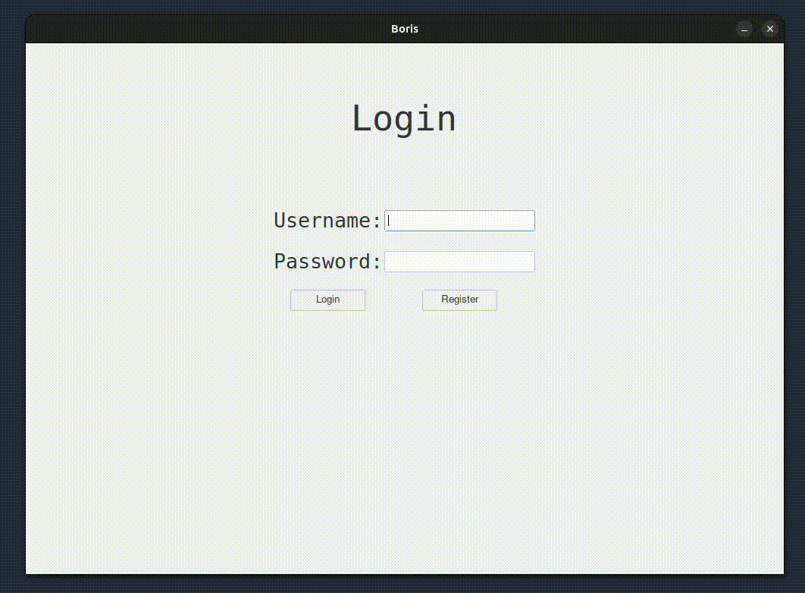

# Intro

A local Tkinter app for managing passwords, tracking finances, making online payments and many more.



## Prerequisite

- Local sql server.
- Python 3+
- Pip 24+

## Run Application

### Clone app files

From your favourite IDE / CLI, clone app files and navigate to parent folder.

```bash
git clone https://github.com/fodare/Boris.git
cd Boris
```

### Prepare and configure DB

You can either use a local SQL server / cloud hosted SQL server. To use a local SQL server, you could use / run a containerized SQL Docker container.

- Pull / Run an SQL instance [Docker SQL server](https://hub.docker.com/r/microsoft/mssql-server). Below is a sample compose file to help manage SQL server container.

```bash
# Create file. e.g SQL-Server-Compose and enter the content below.
version: "3.8"
volumes:
   sqlserver_data:
services:
   sqlserver:
      image: mcr.microsoft.com/mssql/server:2022-latest
      environment:
         - ACCEPT_EULA=Y
         - MSSQL_SA_PASSWORD={enter desired SQL server password}
      ports:
         - 1433:1433
      volumes:
         - sqlserver_data:/var/opt/mssql
      restart: always
      network_mode: bridge
      healthcheck:
         test:
            [
               "CMD-SHELL",
               "/opt/mssql-tools/bin/sqlcmd 
               -S localhost 
               -U sa 
               -P {Value of MSSQL_SA_PASSWORD} 
               -Q 'SELECT 1' || exit 1",
            ]
         interval: 10s
         retries: 10
         start_period: 10s
         timeout: 3s
```

Once the file and its contnet are updated. You can run / start a container with the command below.

```bash
sudo docker compose up -d
```

- Connect to local db and run sql command in file name `DbSetup.sql`, which creates tables, schemas and stored procedure.

### Update app config values

File name `.env` contains some config values to run the application. See comments on fileds below.

```bash
DBSERVERNAME=localhost
DBUSERNAME={enter SQL server username. Default, sa}
DBPASSWORD={enter SQL server password. Value of MSSQL_SA_PASSWORD}
DATBASENAME=Boris
APP_WINDOW_WIDTH=1000
APP_WINDOW_HEIGHT=700
APP_THEME_NAME=breeze
APP_TITLE=Boris
# A 32 url-safe base64 encoded bytes vlaue. Checkout https://fernetkeygen.com/.
# Store and keep code secure.
APP_ENCRYPTION_KEY=''
```

For more themes, checkout [ttkThemes](https://ttkthemes.readthedocs.io/en/latest/themes.html).

### Install dependencies

From the application parent folder, run the command below.

```bash
cd Boris
pip install -r requirements.txt
```

### Ubuntu / Linux: Start application

Copy file `boris.Desktop`, update the path to the application folder in filed `Exec`. On the desktop version, right click on he lancher file and update the file `permision.properties`. Example below.

- Right click on copied `boris.desktop` file and click `Allow lauching` menu.
- Check the `Allow executing file as program` check box.

To start the application simply double click on the launcher copied to the Desktop and application should start.

If you want to register the application in Unbuntu lauch pad, move the updated `boris.desktop` file into `/usr/share/applications`.
